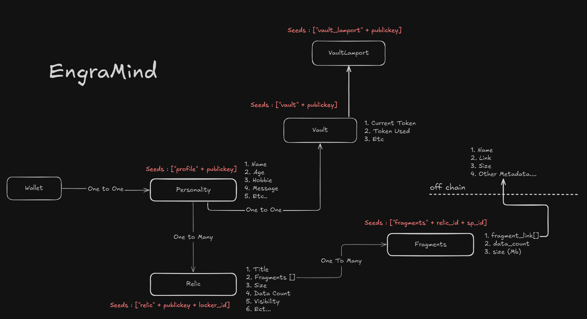

# EternityChain Smart Contract



## Overview

The **EternityChain Smart Contract** is a Solana-based program designed to manage user profiles, relics, fragments, and vaults. It provides a secure and efficient way to store and manage data on-chain, while also enabling token-based interactions. This contract is built using the Anchor framework, which simplifies Solana smart contract development.

---

## Features

- **Personality Management**: Create and manage user profiles with attributes like name, age, hobbies, and custom messages.
- **Relic System**: Manage metadata storage with relics, including descriptions and visibility settings.
- **Fragment Management**: Handle linked data fragments for relics, supporting efficient data storage and retrieval.
- **Vault System**: Enable token-based interactions, including buying and withdrawing tokens using lamports.

---

## Getting Started

### Prerequisites

Before you begin, ensure you have the following installed:

- **Rust and Cargo**: Install from [rust-lang.org](https://www.rust-lang.org/).
- **Solana CLI**: Install from [Solana Docs](https://docs.solana.com/cli/install-solana-cli-tools).
- **Anchor Framework**: Install using:
  ```bash
  cargo install --git https://github.com/coral-xyz/anchor --tag v0.24.2 anchor-cli --locked
  ```

### Installation

1. Clone the repository:
   ```bash
   git clone https://github.com/your-repo/eternity-sc.git
   cd eternity-sc
   ```

2. Build the program:
   ```bash
   anchor build
   ```

3. Deploy the program:
   ```bash
   anchor deploy
   ```

---

## Usage

### Running Tests

Run the tests using the Anchor framework to ensure the program behaves as expected:
```bash
anchor test
```

### Key Instructions

- **Create Personality**: Create a new user profile.
- **Update Relic**: Modify metadata for an existing relic.
- **Add Fragment**: Add a new data fragment to a relic.
- **Buy Token**: Purchase tokens using lamports.

For detailed documentation on each instruction, refer to the [Smart Contract Documentation](./smart_contract.md).

---

## Developer Notes

### Program Structure

The program is divided into the following modules (located in the `/src` folder):
- **instructions/**: Contains all instruction handlers for managing personalities, relics, fragments, and vaults.
- **state/**: Defines on-chain data structures for personalities, relics, fragments, and vaults.
- **errors.rs**: Provides custom error codes and messages for validation and ownership checks.
- **utils.rs**: Includes helper functions for lamport transfers, account reallocations, and other utilities.
- **lib.rs**: The main entry point for the program, registering all modules and instructions.

### Key Concepts

- **Ownership Checks**: Ensure only authorized users can modify data.
- **Validation**: Enforce constraints on input data, such as maximum lengths and limits.
- **Linked Data**: Use fragments to efficiently manage large datasets.

### Example Workflow

1. **Create a Personality**:
   ```bash
   anchor run create_personality --name "Alice" --age 30 --hobbie ["Reading", "Gaming"] --message "Hello, world!"
   ```

2. **Add a Relic**:
   ```bash
   anchor run create_relic --relic_id 1 --name "My Relic" --description "A sample relic."
   ```

3. **Add a Fragment**:
   ```bash
   anchor run m_add_fragment --relic_id 1 --fragment_id 1 --key "0x123..."
   ```

4. **Buy Tokens**:
   ```bash
   anchor run m_buy_token --amount 100
   ```

---

## Resources

- [Anchor Framework Documentation](https://www.anchor-lang.com/)
- [Solana Developer Docs](https://docs.solana.com/)
- [Smart Contract Documentation](./smart_contract.md)

---

## Note

This project is under active development. Contributions and feedback are welcome!